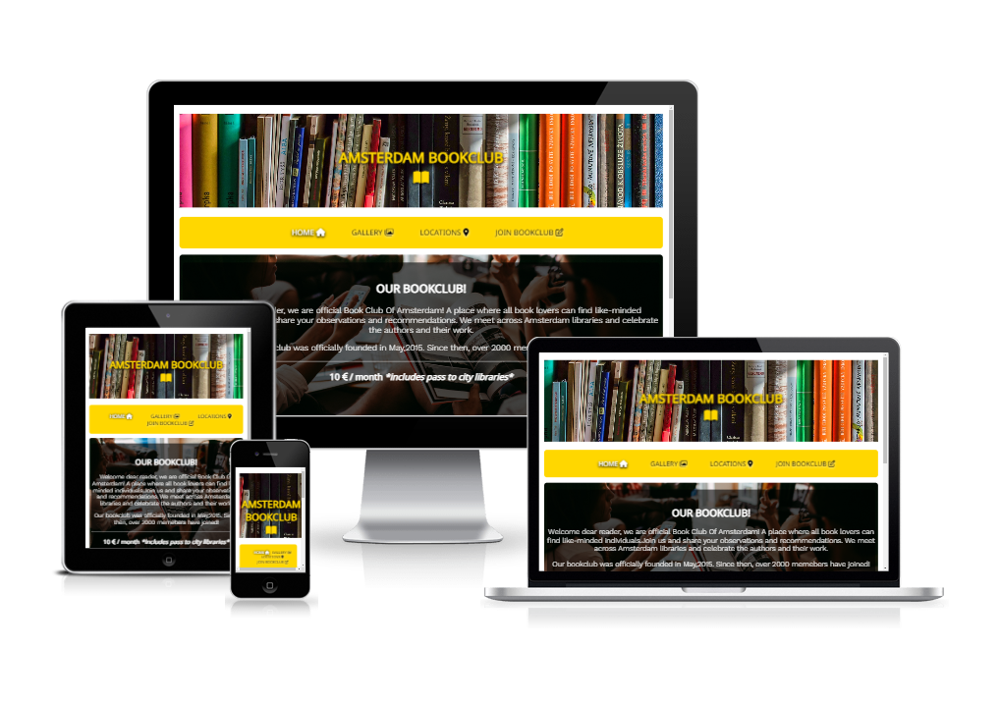

# Book Club Amsterdam

This website is designed for Book Club Amsterdam. It is a website designed to invite user to sign up for book club in Amsterdam. It has nice simple design with direct infomration. It is targeting audiance from all age groups, including elderly, so design is big and clean. 

You can go to the website via direct link here: https://gokralj.github.io/book-club-amsterdam/

# Features

## Navigation bar 

 - Navigation bar consist of links to Home, Gallery, Locations and Sign up form.
 - This bar will allow user to jump between pages easily
 - Nav bar is applied to all pages 

 ## Main

 - Main section contains inviting image of a group with books 
 - Main provides necessary information on what the page is 
 - Main also provides user with pricing for monthly fee and what is included 
 - Later in the page locations will feature which library are listed

 ## Aside 

 - Aside is structured into 3 boxes
 - Each box provides user with information on time and location for book club meetings
 - Background image features one of those libraries 

 ## Footer 

- Footer features links to socail media
- This invites user to seek more information according to prefered platform
- Links are shown as logos of each social media 
- Footer is consistant troughout the website
