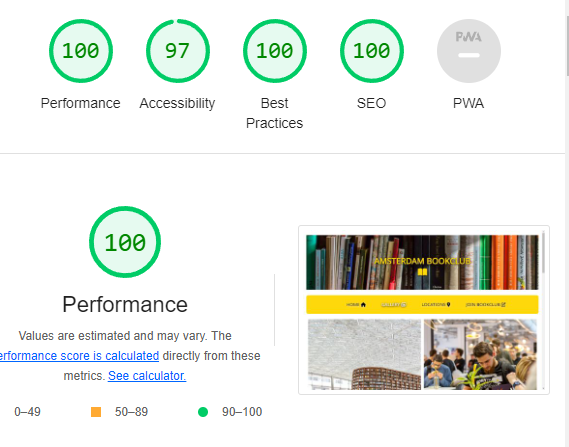

# Book Club Amsterdam

This website is designed for Book Club Amsterdam. It is a website designed to invite user to sign up for book club in Amsterdam. It has nice simple design with direct infomration. It is targeting audiance from all age groups, including elderly, so design is big and clean. 

You can go to the website via direct link here: https://gokralj.github.io/book-club-amsterdam/

# Features

## Navigation bar 

 - Navigation bar consist of links to Home, Gallery, Locations and Sign up form.
 - This bar will allow user to jump between pages easily
 - Nav bar is applied to all pages 

 

 ## Main

 - Main section contains inviting image of a group with books 
 - Main provides necessary information on what the page is 
 - Main also provides user with pricing for monthly fee and what is included 
 - Later in the page locations will feature which library are listed

 

 ## Aside 

 - Aside is structured into 3 boxes
 - Each box provides user with information on time and location for book club meetings
 - Background image features one of those libraries 

 

 ## Footer 

- Footer features links to socail media
- This invites user to seek more information according to prefered platform
- Links are shown as logos of each social media 
- Footer is consistant troughout the website

## Gallery 

- Gallery provides user with beatifuly selected images of different readers 
- Gallery also features photographs of libraries mentioned
- Gallery is design to be big and clear 
- Layout has been kept in 2 columns to accomandate size

## Locations 

- Locations page aims to direct user to 3 main libraries also listed on home page
- It is a clear design with heading followed by google map link window
- Location on map is pinned for each location individually 

## Sign up

- Sign up page features background of a book 
- Form is allocated to the left of the screen freeing the main image 
- Form requires name, last name and email address
- It reatures button with text "Join!"

# Testing 

## Validator Testing

- HTML
- No errors were returned when passing through the official [W3C validator](https://validator.w3.org/nu/?doc=https%3A%2F%2Fgokralj.github.io%2Fbook-club-amsterdam%2F)

- CSS
- No errors were found when passing through the official [(Jigsaw) validator](https://jigsaw.w3.org/css-validator/validator?uri=https%3A%2F%2Fgokralj.github.io%2Fbook-club-amsterdam%2F&profile=css3svg&usermedium=all&warning=1&vextwarning=&lang=en)

## Lighthouse Testing

# Home Page

# Gallery 

# Locations 

# Sign up

### Unfixed Bugs 

- I would like to resolve responsivness on sign up form, image slows it down

## Deployment 

The site was deployed to GitHub pages. The steps to deploy are as follows: 
  - In the GitHub repository, navigate to the Settings tab 
  - From the source section drop-down menu, select the Main Branch
  - Once the Main branch has been selected, the page will be automatically refreshed with a detailed ribbon display to indicate the successful deployment. 
  - I then had to wait a few minutes until the site was fully deployed and it was ready.

The live link can be found here - [Bookclub_Amsterdam](https://gokralj.github.io/book-club-amsterdam/signup.html)

### Content 

- Main text was written by developer
- Icons for the nav bar and footer were taken from [Font Awesome](https://fontawesome.com/)
- Map links were taken from [Google](https://google.com)

### Media 

- All the images on this page were provided by [Pexels](https://www.pexels.com/)

## Code 

I used the below sites to help me design and style my site.

- Reference for Align
  - https://www.w3schools.com/css/css_align.asp

- References for Flex Box
  - https://www.w3schools.com/cssref/pr_class_display.asp
  - https://www.youtube.com/watch?v=RSIclWvNTdQ

## Disclaimer 

- This site is for educations purposes only!